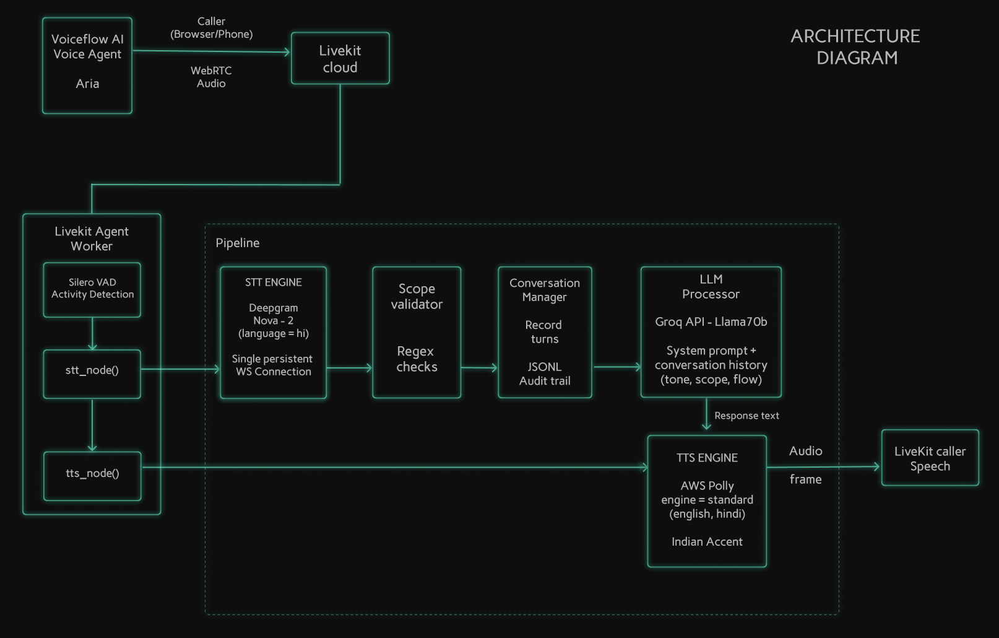
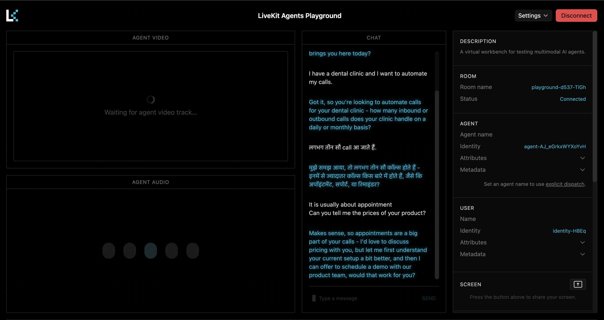

# VoiceFlow AI — Bilingual Presales Voicebot

A bilingual voice agent built with LiveKit Agents 1.5.x. **Aria**, the presales assistant, conducts natural discovery calls in English, Hindi, and Hinglish — automatically matching the caller's language with no explicit switch command required.

---

## Table of Contents

- [VoiceFlow AI — Bilingual Presales Voicebot](#voiceflow-ai--bilingual-presales-voicebot)
  - [Table of Contents](#table-of-contents)
  - [1. Overview](#1-overview)
  - [2. Architecture](#2-architecture)
    - [Key Design Decisions](#key-design-decisions)
  - [3. How Bilingual STT Works](#3-how-bilingual-stt-works)
    - [The Problem](#the-problem)
    - [The Solution — Single `language=hi` Stream](#the-solution--single-languagehi-stream)
  - [4. Preview](#4-preview)
  - [5. Presale Qualification Flow](#5-presale-qualification-flow)
  - [6. Quickstart](#6-quickstart)
    - [Prerequisites](#prerequisites)
    - [Local Setup](#local-setup)
    - [Docker](#docker)
  - [7. Configuration](#7-configuration)
  - [8. Testing \& Evaluation](#8-testing--evaluation)
    - [Running the Test Suite (pytest)](#running-the-test-suite-pytest)
    - [Rubric Evaluator (`evaluate.py`)](#rubric-evaluator-evaluatepy)
  - [9. Future Improvements](#9-future-improvements)

---

## 1. Overview

Aria is a presales voice agent for **VoiceFlow AI**, a call automation platform for Indian businesses. She:

- Greets prospects and conducts a 7-step lead qualification in any language
- Responds entirely in the caller's language — English, Hindi, or Hinglish, per turn
- Enforces scope boundaries: pricing, contracts, and competitor questions are gracefully redirected
- Logs every call to `logs/conversations.jsonl` with timestamps, language switches, and scope violations

**Tech Stack**

| Layer | Technology |
|---|---|
| Voice Framework | LiveKit Agents 1.5.x |
| Speech-to-Text | Deepgram Nova-2 (`language=hi`) |
| LLM | Groq — LLaMA 3.3 70B Versatile |
| Text-to-Speech | AWS Polly — Aditi (standard, Indian accent) |
| VAD | Silero |
| Sentiment Engine | VADER Lexicon (In-memory) |
| Runtime | Python 3.12 |

---

## 2. Architecture



### Key Design Decisions
*(For a comprehensive structural breakdown, see [`docs/ARCHITECTURE.md`](docs/ARCHITECTURE.md))*
- **Streaming Bilingual STT:** A persistent `language=hi` Deepgram stream prevents high-latency WebSocket drops when switching between English and Hindi.
- **Zero-Latency Scope Enforcement:** Hardcoded Regex layers classify user intent instantly before querying the LLM, securely sandboxing competitor/pricing inquiries.
- **VAD & Endpointing Harmony:** Aligning Deepgram's internal acoustic endpointing (`800ms`) with Silero's VAD boundaries prevents fragmented user phrasing.
- **LPU LLM Generation:** Llama 3 via Groq bounds Time-to-First-Token inference to under `<450ms`, preserving lifelike response pacing.
- **Zero-Latency Tone Shifting:** We run VADER sentiment checks across inbound user text locally (`<2ms`), dynamically overriding the LLM system prompt on the fly if the user signals frustration or anger.

---

## 3. How Bilingual STT Works

### The Problem

Most bilingual STT setups restart the speech stream when the language switches. On LiveKit, closing and reopening a WebSocket stream takes 1–3 seconds — causing dead zones mid-conversation that break natural Hinglish flow.

### The Solution — Single `language=hi` Stream

A single Deepgram Nova-2 `language=hi` WebSocket stays open for the entire call:

| What the caller says | What Nova-2 returns | LLM responds in |
|---|---|---|
| "We get 200 calls a day" | Correct English text | English |
| "काफी manual हो जाता है" | Devanagari Hindi text | Hindi |
| "I get around 200 calls, but kaafi manual ho jata hai" | Mixed Hinglish | Hindi (matches caller) |
| "Can you explain in English?" | English text | English |

The Nova-2 `hi` model handles English correctly (confirmed: "Pause for a second." → transcribed perfectly). The LLM instruction — *respond in the language of each turn* — handles all switching with zero stream restarts.

---

## 4. Preview



---

## 5. Presale Qualification Flow

Aria works through 7 discovery areas, one question at a time:

```
START
  └─▶ 1. Industry / Business type
        └─▶ 2. Call volume (daily / monthly)
              └─▶ 3. Primary use case (appointments, support, reminders?)
                    └─▶ 4. Current setup (manual, IVR, other software?)
                          └─▶ 5. Key pain point (missed calls, cost, errors?)
                                └─▶ 6. Decision timeline (active eval or exploring?)
                                      └─▶ 7. Offer 20-min demo with product team
```

**Scope enforcement** — `src/scope_validator.py` runs a regex check on every transcript:

| Topic | Example trigger | Redirect |
|---|---|---|
| Pricing | "how much does it cost" | Pricing covered in demo |
| Discount | "can I get a discount" | Sales team handles this |
| Competitor | "compare with Exotel" | Focus on your specific needs |
| Timeline | "kitna time lagega" | Implementation team will advise |

---

## 6. Quickstart

### Prerequisites

- Python 3.12+
- LiveKit Cloud account — [console.livekit.io](https://console.livekit.io)
- Deepgram API key — [console.deepgram.com](https://console.deepgram.com)
- Groq API key — [console.groq.com](https://console.groq.com)
- AWS credentials with Polly access

### Local Setup

```bash
git clone <repo-url>
cd voicebot-screening-project

python3 -m venv .venv
source .venv/bin/activate
pip install -r requirements.txt

cp .env.example .env
# Fill in your API credentials (see Configuration below)

python src/main.py dev
```

Then open the [LiveKit Agents Playground](https://agents-playground.livekit.io), connect to your project, and speak to Aria.

### Docker

**Using Docker Compose (Recommended)**
Provides a seamless one-command setup and automatically mounts `logs/` back to your host machine so you can review `conversations.jsonl` immediately:
```bash
docker compose up --build -d
```

**Using Standalone Docker**
```bash
docker build -t voiceflow-presales .
docker run --env-file .env -v $(pwd)/logs:/app/logs voiceflow-presales
```
---

## 7. Configuration

Copy `.env.example` to `.env` and fill in:

| Variable | Description |
|---|---|
| `LIVEKIT_URL` | Your LiveKit Cloud WebSocket URL |
| `LIVEKIT_API_KEY` | LiveKit API key |
| `LIVEKIT_API_SECRET` | LiveKit API secret |
| `DEEPGRAM_API_KEY` | Deepgram API key |
| `GROQ_API_KEY` | Groq API key |
| `AWS_ACCESS_KEY_ID` | AWS access key (for Polly) |
| `AWS_SECRET_ACCESS_KEY` | AWS secret key |
| `AWS_DEFAULT_REGION` | AWS region — use `ap-south-1` for lowest TTS latency |

---


## 8. Testing & Evaluation

This project includes a comprehensive, automated test suite to ensure strict compliance with the project rubric. The tests verify scope enforcement, bilingual capabilities, and LLM latency boundaries without requiring manual voice interaction.

### Running the Test Suite (pytest)
The core logic and live Groq LLM integration can be tested using `pytest`.
```bash
python -m pytest tests/ -v
```
This executes **40 automated tests** across three domains:
1. `test_scope_validation.py` - Verifies competitive/pricing intent is intercepted before the LLM.
2. `test_language_switching.py` - Validates bilingual rules, tag extraction, and Devanagari detection.
3. `test_llm_integration.py` - Queries the live LLaMA 3.3 70B model with real prompts to verify sub-second latency and zero-leak scope compliance.

A static copy of the verified test results is available here: [TEST_RESULTS.md](tests/TEST_RESULTS.md).

### Rubric Evaluator (`evaluate.py`)
To automatically grade the agent against the project latency and compliance thresholds:
```bash
python tests/evaluate.py
```
This script parses the logged conversations in `logs/` and generates a Scorecard validating End-to-End Latency (<2.5s), 100% Scope Compliance, Tone, and Functional features.

> [More details in evaluation.md file](docs/evaluation.md)

---

## 9. Future Improvements

| Area | Improvement |
|---|---|
| STT scalability | Support dynamic instantiation of Nova-3 (`en-IN`) for scalability of English-only deployments |
| STT accuracy | Test Deepgram Nova-3 for Hindi when streaming support is confirmed |
| Language detection | Track per-session accuracy; flag turns with low `dg_tag` confidence |
| Third language | Add Tamil or Kannada using a second parallel stream |
| Conversation logs | Dashboard to review `logs/conversations.jsonl` per call |
| Sentiment analysis | Detect frustrated callers and adjust Aria's tone |
| Production deploy | AWS Fargate + CloudWatch for agent monitoring and auto-scaling |
